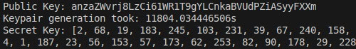
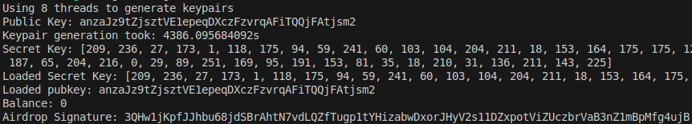

### One thread computing


#### Duration 
```
11804.034446506s
```

#### Public Key:
```
anzaZWvrj8LzCi61WR1T9gYLCnkaBVUdPZiASyyFXXm
```
#### Secret Key: 
```
[2, 68, 19, 183, 245, 103, 231, 39, 67, 240, 158, 117, 246, 135, 157, 7, 148, 15, 34, 73, 126, 119, 254, 66, 217, 16, 29, 3, 115, 29, 163, 196, 8, 168, 43, 188, 224, 26, 154, 66, 36, 78, 61, 69, 74, 1, 187, 23, 56, 153, 57, 173, 62, 253, 82, 90, 178, 29, 228, 100, 75, 27, 129, 160]
```

### Multithreading computing


#### Duration 
```
4386.095684092s
```

#### Public Key:
```
anzaJz9tZjsztVE1epeqDXczFzvrqAFiTQQjFAtjsm2
```
#### Secret Key: 
```
[209, 236, 27, 173, 1, 118, 175, 94, 59, 241, 60, 103, 104, 204, 211, 18, 153, 164, 175, 175, 121, 204, 80, 69, 186, 249, 66, 4, 133, 155, 242, 135, 8, 168, 43, 183, 91, 87, 242, 83, 161, 251, 80, 187, 65, 204, 216, 0, 29, 89, 251, 169, 95, 191, 153, 81, 35, 18, 210, 31, 136, 211, 143, 225]
```